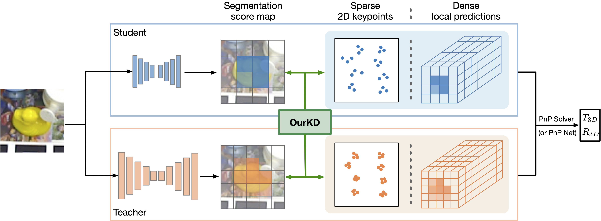

This repository is the official implementation of [Knowledge Distillation for 6D Pose Estimation by Aligning Distributions of Local Predictions](TODO), CVPR 2023.

# KD-6D-pose-aligning-distributions-of-local-predictions

> Code is in early release and may be subject to change. Please feel free to open an issue in case of questions.

The implementation is based on PyTorch. Here are codes for baseline and the proposed method with WDRNet+ on LINEMOD dataset in the paper. 

## Overview

<!--  -->
<div align="center">
  
</div>
<p align="justify">
  Figure 1: <b> Overview of our method. </b> (better viewed in color) The teacher and student follow the same general architecture, predicting either sparse 2D keypoints or dense local predictions. Given an RGB input image, they output both a segmentation score map by classifying the individual cells in the feature map, and 2D keypoints voted by each cell as in WDRNet, or one prediction per cell, e.g., probabilities of 16D binary codes for ZebraPose. The local predictions, either sparse or dense, then form correspondences, which are passed to a PnP solver or a PnP network to obtain the final 3D translation and 3D rotation. Instead of performing naive prediction-to-prediction distillation, we propose a strategy based on optimal transport that lets us jointly distill the teacher's local prediction distribution with the segmentation score map into the student.
</p>

## Environment 
We provide a docker file for better reproducibility. Note that the base image relies access to `nvcr.io`. Then, you need to login to build the docker image. Please see [nvidia-docker](https://github.com/NVIDIA/nvidia-docker) for more information to build and run docker container. 

Please refer to the `requirements.txt` to build up the environment.

We mainly use NVIDIA Tesla V100 and A100 for our experiments. 

## Data 
All experiments are conducted on LINEMOD dataset. Please download the dataset and make sure you can run a baseline model successfully. More details are [here](https://bop.felk.cvut.cz/datasets/). The dataset should be organized as:
```
./data/linemod
 ├── [cls_id]_train.txt
 ├── [cls_id]_test.txt
 ├── linemod_bbox.json
 ├── models
     ├── models_info.json
     ├── obj_[cls_id].ply
 ├── real
     ├── [cls_id]
         ├── mask_visib
         ├── rgb
         ├── scene_camera.json  
         ├── scene_gt.json  
         ├── scene_gt_info.json
```

Note that `[cls_id]_train.txt` and `[cls_id]_test.txt` contain paths to all images for the `[cls_id]`. Or one can adjust their own data to the codebase.

## Train the Teacher and Student
To train the teacher and student models, simply set the kd_weight as 0 and set the backbone as `darknet53`, `darknet_tiny`, `darknet_tiny_h`.

To train the distilled models, please set the kd_weight as 5 and set the backbone as `darknet_tiny`, `darknet_tiny_h`, and point to the weight file of the teacher model.

Please see and run the training script under the folder 

```
bash train.sh 
```

This will reproduce the result of Ape in Table 2 in the main paper:

Table A: Results of our distillation with Darknet-tiny-H on class Ape

|           Model 	|     ADI-0.1d	|  
|----------------:	|:------------:	|
|        Teacher 	| 82.6 	      | 
|        Student    | 65.4 	      | 
|        Ours       | 69.4 	      | 


## Evaluation
The trained model can be evaluated as follow:
```
python3 test.py \
       --config_file ./configs/ape.yaml \
       --backbone darknet_tiny_h \
       --weight_file [weight-file]
```

## Citation
<!-- ```
@inproceedings{NEURIPS2020_expandnets,
               author = {Guo, Shuxuan and Alvarez, Jose M. and Salzmann, Mathieu},
               booktitle = {Advances in Neural Information Processing Systems},
               editor = {H. Larochelle and M. Ranzato and R. Hadsell and M. F. Balcan and H. Lin},
               pages = {1298--1310},
               publisher = {Curran Associates, Inc.},
               title = {ExpandNets: Linear Over-parameterization to Train Compact Convolutional Networks},
               url = {https://proceedings.neurips.cc/paper/2020/file/0e1ebad68af7f0ae4830b7ac92bc3c6f-Paper.pdf},
               volume = {33},
               year = {2020}
}
``` -->